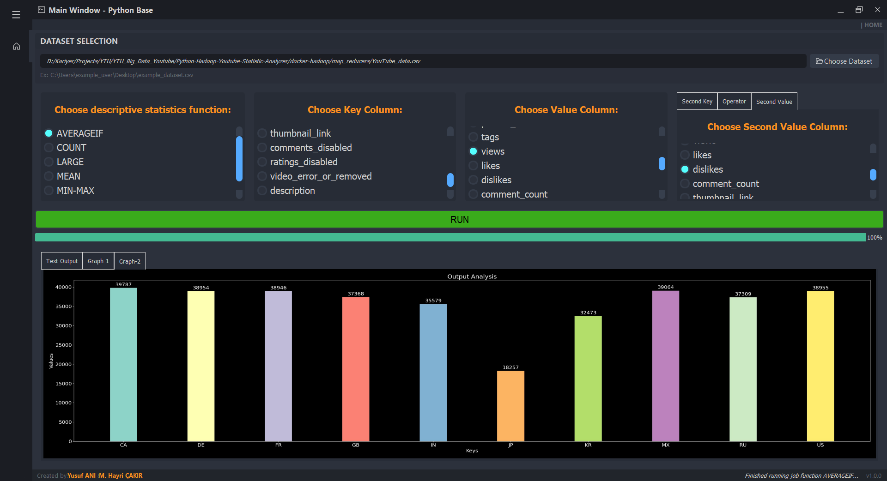

# Information
[](images/intro.png)

In this repo, the codes of the tool that can be used in the Docker Python 3 environment are shared. You can find the dataset we used here


# Installation

Project have 2 components:
- Docker Hadoop Environment ( Required )
- Python GUI 

You can clone the repo with following code 
```sh
git clone https://github.com/yusufani/Python-Hadoop-Youtube-Statistic-Analyzer.git
```

- ## Docker Installation
Make sure that you have [docker](https://docs.docker.com/engine/install/ubuntu/) environment.
```sh
cd docker-hadoop
docker-compose up -d 
```
Install python to nodes
```sh
docker exec -it namenode bash -c "apt update && apt install python3 -y"
docker exec -it datanode1 bash -c "apt update && apt install python3 -y"
docker exec -it datanode2 bash -c "apt update && apt install python3 -y"
docker exec -it datanode3 bash -c "apt update && apt install python3 -y"
docker exec -it resourcemanager bash -c "apt update && apt install python3 -y"
docker exec -it nodemanager bash -c "apt update && apt install python3 -y"
```

- ## GUI Installation
```sh
pip install docker
pip install PyQt5
pip install PySide2
pip install pymitter
```

# Usage without GUI
For give command we need to be in namenode bash:
```sh
docker exec -it namenode bash
cd map_reducers
```
To load the dataset, the dataset must be in the docker environment. For this, I linked the map_reducers folder with the system in the docker folder. If you put your dataset inside the map_reducers folder. It will also appear under map_reducers in Namenode. After that you can upload your data with following commmand:
```sh
hadoop fs -rm -r input # Clearing input folder if exists
hdfs dfs -put <DATASET_PATH> input
```

We are completely ready for running hadoop commands. Under map_reducers folder we also supply example map reducer python files. You can create your own map reducers if you want.

Running hadoop code examples: 
General scheme can be sum up with mappper.py <key_column_index> <value_column_index>. We are giving processing columns as index of dataset. For example :-1 corresponds to the last column. 'count' is special command for putting value to 1.


## EXAMPLE COMMANDS
```sh
hadoop fs -rm -r output
hadoop jar hadoop-streaming-3.2.1.jar  -mapper "mapper.py -1 count"    -reducer reducer.py -input input -output output -file DS_COUNT/mapper.py -file DS_COUNT/reducer.py

```
```sh
hadoop fs -rm -r output
hadoop jar hadoop-streaming-3.2.1.jar  -mapper "mapper.py -1 9"    -reducer reducer.py -input input -output output -file DS_MIN-MAX/mapper.py -file DS_MIN-MAX/reducer.py
```
```sh
hadoop fs -rm -r output
hadoop jar hadoop-streaming-3.2.1.jar  -mapper "mapper.py -1 9"    -reducer reducer.py -input input -output output -file DS_MEAN/mapper.py -file DS_MEAN/reducer.py
```

```sh
hadoop fs -rm -r output
hadoop jar hadoop-streaming-3.2.1.jar  -mapper "mapper.py -1 9 11 > 10"    -reducer reducer.py -input input -output output -file DS_AVERAGEIF/mapper.py -file DS_AVERAGEIF/reducer.py
```

```sh
hadoop fs -rm -r output
hadoop jar hadoop-streaming-3.2.1.jar  -mapper "mapper.py -1 9"    -reducer "reducer.py 1" -input input -output output -file DS_LARGE/mapper.py -file DS_LARGE/reducer.py
```
```sh
hadoop fs -rm -r output
hadoop jar hadoop-streaming-3.2.1.jar  -mapper "mapper.py -1 9"    -reducer reducer.py -input input -output output -file DS_WORD-COUNT/mapper.py -file DS_WORD-COUNT/reducer.py
```

## Reading Results 
```sh
hdfs dfs -cat output/part-00000
```

# Usage with GUI
GUI can be run with following code but you need de be sure that your docker environment is ready.
Check with following code :

```sh
cd docker-hadoop
docker-compose up -d 
cd ..
```

After, you can easily run following code:
```sh
cd GUI_python
python main.py
```

A short intro video for using program:
[](https://www.youtube.com/watch?v=Qfl47hRlPoA)


